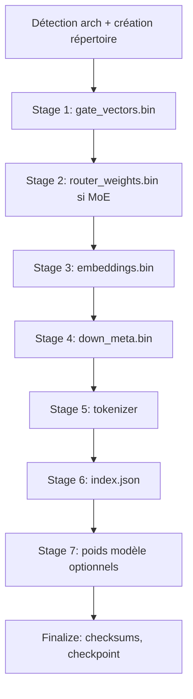

# Guide détaillé : FFN dans le format Vindex (crate `larql-vindex`)

Ce document décrit **comment le bloc FFN (feed-forward) est pensé, extrait, stocké et exploité** dans le projet **LarQL**, à partir du code du crate  
`larql-main/crates/larql-vindex`. Il complète ce que vous voyez côté inférence dans `openV/vindex-infer` (fichiers plats `gate_vectors.bin`, `up_weights.bin`, `down_weights.bin`, etc.).

---

## 1. Objectifs du design (les « idées derrière »)

### 1.1 Un même format, deux usages

Le Vindex ne vise pas seulement **l’inférence**. Il vise aussi :

| Besoin | Rôle du FFN dans le Vindex |
|--------|---------------------------|
| **Parcourir / interpréter** (WALK, DESCRIBE, KNN) | Chaque **ligne** de `W_gate` (et méta associées) est une **direction dans l’espace caché** indexable — on peut poser « quelle feature réagit à ce vecteur ? » sans charger PyTorch. |
| **Rejouer le réseau** (INFER) | Les **tenseurs complets** gate / up / down (f16, f32, Q4_K, FP4…) permettent le même produit matrice–vecteur qu’en HF, étape SwiGLU comprise. |

Les niveaux d’extraction (`ExtractLevel`, voir §4) coupent précisément **ce qui est sur disque** selon que vous voulez seulement du *browse* ou une passe forward locale.

### 1.2 Vue « rang-1 » / par ligne (feature)

Dans un MLP type **SwiGLU** (Gemma, Llama, etc.), les matrices ont la forme :

- `gate_proj.weight` : `[intermediate, hidden]` — une **ligne** = une **feature** (un neurone de la couche intermédiaire) vue comme vecteur dans `ℝ^hidden`.
- `up_proj.weight` : idem.
- `down_proj.weight` : `[hidden, intermediate]` — une **colonne** = contribution d’une feature intermédiaire vers **toutes** les dimensions cachées.

Le Vindex **matérialise explicitement** cette granularité :

- **`gate_vectors.bin`** : empile les lignes gate (éventuellement par expert en MoE), avec des **offsets par couche** dans `index.json` → `layers[]`.
- **`down_meta.bin`** : pour chaque **colonne** de `down`, stocke **quels tokens du vocabulaire** seraient les plus stimulés si cette seule colonne projetait l’embedding (voir §5) — utile pour l’étiquetage et le clustering « sémantique ».

### 1.3 Streaming et mémoire

Le pipeline **`build_vindex_streaming`** (`extract/streaming/mod.rs`) mmap les `safetensors` et traite **couche par couche** : la mémoire pic ≈ embeddings + une couche, pas le modèle entier — indispensable pour les très gros modèles / MoE.

---

## 2. Schéma du pipeline d’extraction (streaming)

Ordre réel des étapes dans `build_vindex_streaming` :

Référence : `extract/streaming/mod.rs` — orchestration ; chaque stage est un `impl StreamingContext` dans `extract/streaming/stages/*.rs`.

---

## 3. Étape par étape : ce que fait chaque partie pour le FFN

### Étape A — Stage « gate vectors » (`gate_vectors.bin`)

**Fichier :** `extract/streaming/stages/gate_vectors.rs`  
**Sortie :** `gate_vectors.bin` (+ entrées `VindexLayerInfo` : `layer`, `num_features`, `offset`, `length`, champs MoE optionnels).

**Dense (cas standard, ex. Gemma)**  
Pour chaque couche `L` :

1. Résolution de la clé tenseur HF via l’architecture (`arch.ffn_gate_key(layer)`), normalisation des préfixes.
2. Lecture mmap du tenseur `gate_proj.weight` en **f32** (`get_tensor_f32`).
3. Écriture des **lignes** `[intermediate × hidden]` dans le fichier binaire, au format de stockage choisi (`write_floats` → f16 ou f32 selon `StorageDtype`).

**Intuition :** le fichier est une **concaténation plate** de toutes les lignes gate de toutes les couches ; `index.json` → `layers[i].offset/length` permet de retrouver la tranche de la couche `i`.

**MoE**  
- **Mixtral-like** : boucle sur les experts ; chaque expert contribue son gate (ou une **SVD résumée** si `LARQL_SUMMARY_FEATURES_PER_EXPERT=K` — voir commentaires dans le source : éviter des centaines de Go sur DeepSeek-V4-like).  
- **MXFP4 packé** : déquantification des blocs experts, extraction de la **moitié « gate »** du tenseur gate+up fusionné.  
- **Hybride (ex. Gemma 4 26B A4B)** : utilisation du gate FFN **dense** pour le routage KNN même si les experts sont ailleurs.

**Option `drop_gate_vectors`**  
Si quantification **Q4K** et option activée : les octets gate peuvent ne pas être écrits séparément ; le chargeur peut **reconstruire** le gate depuis `interleaved_q4k.bin` (voir commentaires `streaming/mod.rs` et `gate_vectors.rs`).

---

### Étape B — Embeddings (`embeddings.bin`)

**Fichier :** `extract/streaming/stages/embeddings.rs` (non détaillé ici).

Les embeddings sont la **table `E`** de taille `[vocab_size, hidden]`. Ils servent :

- au forward (tête « tied » souvent) ;
- aux **projections vocab** utilisées pour `down_meta` et pour les labels « top token » des features gate (via vocab « whole-word », voir §6).

---

### Étape C — Métadonnées « down » (`down_meta.bin`)

**Fichier :** `extract/streaming/stages/down_meta.rs`  
**Constante de fichier :** `format/filenames.rs` → `DOWN_META_BIN`.

Pour chaque couche (et chaque matrice `down` — dense ou liste d’experts) :

1. Chargement de `W_down` (forme conceptuelle `[hidden, intermediate]` en colonnes « features »).
2. Pour des **lots de colonnes** (`FEATURE_PROJECTION_BATCH`) :
   - `chunk_logits = matmul(E, W_chunk)` avec `larql_compute::CpuBackend` — donc  
     **logits « vocab » induits par chaque colonne de down seule**, sans passer par le reste du réseau.
3. Pour chaque colonne / feature : sélection des **top `down_top_k`** indices de tokens + scores, décodage tokenizer → enregistrement `FeatureMeta` (top token, `top_k` entries, etc.).
4. Écriture binaire via `format/down_meta::write_binary`.

**Idée clé :** une colonne de `down_proj` est une **direction dans l’espace caché de sortie du FFN** ; la multiplication `E @ colonne` répond à : « si le vecteur d’activation intermédiaire n’avait qu’un seul scalaire sur **cette** feature, quels sous-mots du vocabulaire monteraient le plus au logits ? ». C’est une **sonde lexicale** attachée à chaque neurone intermédiaire, très utile pour le **DESCRIBE** / clustering (§7), pas pour remplacer le softmax du LM head en prod.

**MoE / résumé**  
Le même `LARQL_SUMMARY_FEATURES_PER_EXPERT` peut **limiter** le nombre de colonnes pour lesquelles on calcule la méta (éviter des exaFLOPs sur 256 experts × 2048 features).

---

### Étape D — `index.json` et niveaux d’extraction

**Fichier :** `config/index.rs` — types `VindexConfig`, `ExtractLevel`, `VindexLayerInfo`.

**`ExtractLevel`** (ordre strict croissant) :

| Niveau | Fichiers / composantes FFN typiques | Permet |
|--------|-------------------------------------|--------|
| **browse** | gate, embed, **down_meta**, tokenizer | KNN, marches, interprétation — **pas** de forward FFN complet sans autre source de poids. |
| **attention** | + `attn_weights.bin`, `norms.bin` | Client « moitié acte 2 » (FFN externe). |
| **inference** | + **`up_weights.bin`**, **`down_weights.bin`** (ou équivalent quantifié) | INFER local (comme `vindex-infer`). |
| **all** | + `lm_head` si non tied, extras | COMPILE. |

Les méthodes `writes_attn()`, `writes_ffn()` sur l’enum encodent ces règles.

**`layers` dans `index.json`**  
Décrit **uniquement** la disposition de **`gate_vectors.bin`** (nombre de features, offset octet, longueur). Les fichiers `up`/`down` ont une disposition **fixe par architecture** (couche × dimensions) côté writer/reader d’inférence.

---

### Étape E — Écriture des poids FFN « complets » (inférence)

**Fichier :** `extract/streaming/stages/model_weights.rs` → `maybe_write_model_weights`.

- Si `extract_level` exige l’attention **ou** si une **quantification** (ex. Q4K) est active, les poids sont matérialisés.
- **Q4K** : les FFN ne vont pas dans `up_weights.bin` / `down_weights.bin` séparés ; elles vivent dans **`interleaved_q4k.bin`** (gate|up|down packés), avec options d’optimisation (ex. `down_features_q4k.bin` en orientation **feature-major** pour un décodage par ligne — voir commentaires dans `format/filenames.rs`).

**Idée :** un seul format disque ne suffit pas à tous les cas d’usage ; le crate unifie l’**accès** via des traits (§8).

---

## 4. Autre voie d’extraction : « vecteurs enrichis » (walker)

**Fichier :** `walker/vector_extractor/ffn.rs`

Pour des workflows **analyse / export** (JSONL, records avec `top_k` tokens), le code peut :

- parcourir **chaque colonne** de `down_proj` et écrire un `VectorRecord` avec vecteur + `top_k` dérivés de `embed.dot(W_down)` ;
- parcourir **chaque ligne** de `gate_proj` / `up_proj` avec `embed.dot(W_gate^T)` ou `embed.dot(W_up^T)` et les mêmes métadonnées.

C’est la même **math de projection vocab** que pour `down_meta`, mais orientée **fichiers d’analyse** plutôt que binaire compact `down_meta.bin`.

---

## 5. Lien avec le forward SwiGLU (inférence exacte)

Côté LarQL, le **sens mathématique** du FFN reste celui de HF :

1. `gate = W_gate @ x` (ligne par ligne = produits scalaires des lignes avec `x`).
2. `up = W_up @ x`.
3. `hidden_act = activation(gate) * up` (Gemma : `gelu_tanh` sur la gate, etc., défini côté modèle / inférence).
4. `delta = W_down @ hidden_act`.

Le Vindex **ne change pas cette formule** au niveau `Inference` : il change **comment les poids sont stockés** (f16 mmap, Q4_K, FP4, interleaved…) et **quelle métadonnée** est précalculée pour l’outil (down_meta, clusters).

`openV/vindex-infer` lit les fichiers plats et reproduit exactement ces produits — c’est la face « runtime minimal » du même format.

---

## 6. Labels gate : « whole-word » et `gate_tops.rs`

**Fichier :** `extract/build_helpers/gate_tops.rs`

Pour éviter que chaque **sous-mot** BPE ne domine l’étiquette d’une feature, LarQL construit un sous-ensemble de **tokens « mots entiers »** (`build_whole_word_vocab` appelé depuis `down_meta.rs`).

Ensuite, pour chaque batch de lignes gate :

- `proj = ww_embed @ chunk_gate^T` ;
- argmax sur l’axe vocabulaire restreint → **un token lisible par feature**.

Pour un FFN **non gated** (GPT-2, StarCoder2), la même logique utilise **`ffn_up`** à la place de `ffn_gate` (`FfnType::Standard`).

**Idée :** donner à chaque ligne gate un **libellé lexical stable** pour l’UI et le clustering, indépendamment du bruit BPE brut.

---

## 7. Clustering de relations (couche sémantique au-dessus du FFN)

**Fichier :** `extract/build_helpers/clustering.rs`

À partir de directions + tokens d’entrée/sortie collectés :

1. Matrice `[n_features, hidden]`.
2. **k-means** (`MAX_RELATION_CLUSTERS`, `RELATION_KMEANS_ITERS`).
3. **Étiquetage** :
   - couche « output » : matching **Wikidata** sur les tokens de sortie ;
   - sinon : labels par **embeddings des centroïdes** + heuristiques (`auto_label_clusters_from_embeddings`).
4. Écriture `relation_clusters.json` et `feature_clusters.jsonl`.

**Idée :** passer des **millions de lignes gate** à **quelques clusters** interprétables (« relations »), exploitable par DESCRIBE / SELECT.

---

## 8. Chargement unifié : `FfnRowAccess` et stockages multiples

**Fichier :** `index/types/ffn_row/mod.rs`

Le trait **`FfnRowAccess`** expose `ffn_row_dot(layer, component, feat, x)` où `component` est **0=gate, 1=up, 2=down** :

1. Essayer **FP4/FP8** si présent.
2. Sinon matrices **natives** mmap (interleaved gate/up/down, ou `up_layer_matrix` / `down_layer_matrix`, ou vecteur down « feature-major »).
3. Sinon fallback **Q4K** (`q4k_ffn_row_dot`).

**Idée :** le **noyau de marche / KNN** (produit scalaire ligne par ligne) reste **identique** quel que soit le backing store — le format Vindex peut évoluer (compression) sans réécrire les algorithmes de walk.

---

## 9. Synthèse : « comment on a réussi à faire ça pour le FFN »

1. **Décomposer** le MLP en **objets indexables** : lignes gate/up, colonnes down, tous alignés sur `hidden`.
2. **Précalculer** des **ponts vers le vocabulaire** (`down_meta`, top tokens gate/up/down) via une seule grande multiplication `E @ W` par blocs — coût maîtrisé, streaming, batches.
3. **Séparer les tiers** (`browse` vs `inference`) pour que la **découverte** (léger) et la **recompilation numérique** (lourd) coexistent.
4. **Unifier l’accès** (`FfnRowAccess`) pour que Q4K / FP4 / f32 soient des **détails d’implémentation** derrière la même abstraction « une ligne FFN à la fois ».
5. **MoE & quantifs packées** : branches dédiées dans `gate_vectors.rs` et `down_meta.rs` pour ne pas exploser RAM ni disque, avec voie **SVD résumée** pour les familles à très nombreux experts.

---

## 10. Fichiers source à lire en priorité (carte de lecture)

| Sujet | Chemin sous `larql-main/crates/larql-vindex/` |
|--------|-----------------------------------------------|
| Orchestration streaming | `src/extract/streaming/mod.rs`, `src/extract/streaming/context.rs` |
| Écriture gate | `src/extract/streaming/stages/gate_vectors.rs` |
| Down meta | `src/extract/streaming/stages/down_meta.rs` |
| Poids optionnels | `src/extract/streaming/stages/model_weights.rs` |
| Niveaux + index.json | `src/config/index.rs` |
| Noms de fichiers | `src/format/filenames.rs` |
| Labels gate whole-word | `src/extract/build_helpers/gate_tops.rs` |
| Clustering | `src/extract/build_helpers/clustering.rs` |
| Export analyse FFN | `src/walker/vector_extractor/ffn.rs` |
| Accès ligne unifié | `src/index/types/ffn_row/mod.rs` |
| Résumé SVD MoE | `src/extract/moe_svd.rs` |

---

## 11. Référence externe au dépôt openV

- Inférence **consommateur** des mêmes binaires : `openV/vindex-infer/README.md`, `src/vindex.rs`, `src/inference.rs`.

---

*Document généré à partir du code LarQL (`larql-vindex`) pour le dépôt openV. Pour toute évolution du format on-disk, se référer aussi à `larql-main/docs/specs/vindex-format-spec.md` si présent dans votre clone.*
